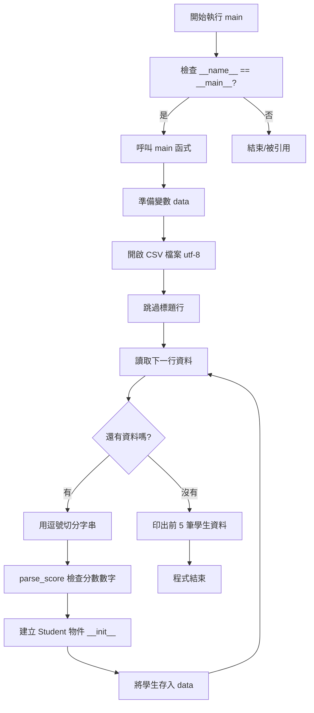

# Python CSV 資料解析與 Student Class

## 1. Class 設計
```python
class Student:
```
> **定義學生物件** 

## 2. Python `__init__` 參數解析

### * 什麼是 `__init__`？
`__init__` 是一個**特殊方法**，它的作用是在你建立物件時，自動幫這個物件設定「初始狀態」

* **自動執行**：當你寫下 `Object = ClassName()` 時，它就會自動跑起來
* **主要功能**：定義**屬性**，例如名字、分數等

---

### * 搞懂 `self`
`self` 代表**「這個物件（實例）自己」**。

當在寫 `class Student` 的代碼時，根本不知道未來使用者會把這個學生取名為甚麼， <br>
所以類別內部的代碼必須先寫好，需要一個「臨時的代名詞」來代表那個即將被生出來的對象
* **這個「代名詞」就是 `self`**
* **它的意思就是：「雖然我現在還不知道我叫什麼名字，但總之就是『我』自己」**

---

```python 
def __init__(
        self,
        id_: str,
        name: str,
        chinese_score: float | None,
        english_score: float | None,
        math_score: float | None,
):
```

| 程式碼 | 用途 |
| :--- | :--- |
| `__init__` | **當要建立一個新的物件時，系統會自動且第一個執行這個方法** |
| `self` | **代表每一次那個新創建的對象 (定義類別方法的第一個參數永遠必須是 `self`)**|
| `...: str` | **這不是強制規定，而是提示型別** |
| `float \| None` | **代表可能是 `float` 或 `None`**|

## 3. `__str__` 方法
```python
def __str__(self):
        return f"{self.name} (ID: {self.id}) - Chinese: {self.chinese_score}, 
        English: {self.english_score}, Math: {self.math_score}"
```
> **物件轉成字串時要怎麼顯示**

## 4. parse_score 函式
> **有時候成績單上會空空的，或者寫錯字。這個函式就像一個「檢查員」**。

```python
def parse_score(text: str) -> float | None:
    text = text.strip()
    if text == "":
        return None
    try:
        return float(text)
    except ValueError:
        return None
```

| 程式碼 | 用途 |
| :--- | :--- |
| `text.strip()` | **先把文字前後沒用的空格刪掉** |
| `if text = ""` | **代表是空值**|
| `try...except` | **電腦會試著把文字變成數字（float(text)），如果文字內容是亂寫的（例如寫了「缺考」而不是數字），電腦會發生錯誤；這時 except 就會接住錯誤，回傳 None（代表沒有資料），防止壞掉停止** |


## 5. 讀取 `main()` 函式
```python
def main():
    data: list[Student] = []
    with open("data/student_scores_100_missing.csv", encoding="utf-8") as f:
        next(f)
        for line in f:
            id_, name, chinese_score, english_score, math_score = line.strip().split(",")
            data.append(Student(id_, name, parse_score(chinese_score),          
            parse_score(english_score), parse_score(math_score)))
```
### 關鍵變數：`data: list[Student] = []`
#### 1. `data`: 一個變數名稱
#### 2. `list[Student]` (型別提示):
* **`list`: 告訴電腦這是一個「清單」（串列），裡面可以方很多東西**
* **`[Student]` 指定清單裡面只能裝定義好的 Student（學生）物件**

---

### 代碼解釋：
* **`with open()`：打開存放資料的 CSV 檔案。這裡用了 encoding="utf-8"，是為了確保電腦能正確讀取檔案裡的中文字，不會變成亂碼**
* **`next(f)`：這是在讀取檔案時跳過第一行（通常是標題，像是「姓名、成績」等字眼）**
* **`line.strip().split(",")`：把每一行資料按照「逗號」分開**

## 6. if `__name__` == `"__main__"` : main()

> **只有在「正確的時機」才會啟動主程式**

| 執行情況 | `__name__` 的值 | 執行結果 |
| :--- | :--- | :--- |
| **直接執行這份檔案** | `"__main__"` | ✅ 執行 `main()` 內容。 |
| **被別的檔案 `import`** | 檔案的名字 (如 `"student_tool"`) | ❌ 只載入定義，**不執行** `main()`。 |

## 6 程式執行流程圖
